# AgriSmart - Main Use Cases và Biểu đồ PlantUML

Tài liệu này liệt kê các use case chính đang có trong codebase hiện tại. Biểu đồ hoạt động và biểu đồ tuần tự được giản lược để tập trung vào luồng chính, còn các nhánh phụ được mô tả ngắn trong nội dung.

## Danh sách use case chính

| ID | Use case | Actor chính | Mô tả ngắn |
|---|---|---|---|
| UC01 | Đăng nhập hệ thống | Nông dân, Quản trị viên | Xác thực tài khoản, tạo phiên bằng cookie HttpOnly |
| UC02 | Đăng xuất hệ thống | Nông dân, Quản trị viên | Kết thúc phiên, xóa cookie và trả về màn đăng nhập |
| UC03 | Xem dashboard theo farm | Nông dân, Quản trị viên | Xem thống kê, biểu đồ cảm biến, cảnh báo nhanh; admin chọn farm để xem dữ liệu tương ứng |
| UC04 | Quản lý thiết bị theo farm | Nông dân, Quản trị viên | Xem danh sách thiết bị; farmer có thể thêm/sửa/xóa, admin chỉ xem/sửa/xóa theo farm |
| UC05 | Quản lý cảnh báo theo farm | Nông dân, Quản trị viên | Farmer xem danh sách cảnh báo; admin xem thống kê cảnh báo theo farm |
| UC06 | Đánh dấu cảnh báo đã đọc | Nông dân | Đánh dấu alert là đã đọc và cập nhật giao diện |
| UC07 | Xuất báo cáo CSV cảm biến | Nông dân | Tải báo cáo nhanh từ dữ liệu cảm biến đang xem |
| UC08 | Quản lý farmer | Quản trị viên | Xem danh sách farmer, tạo farmer mới, khóa/mở khóa tài khoản |

## UC01 - Đăng nhập hệ thống

### Bản đồ use case

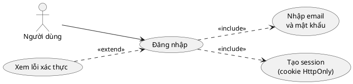

### Biểu đồ hoạt động

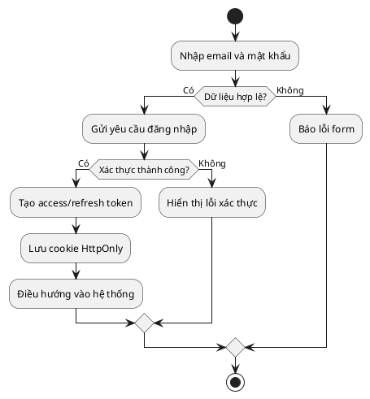

### Biểu đồ tuần tự

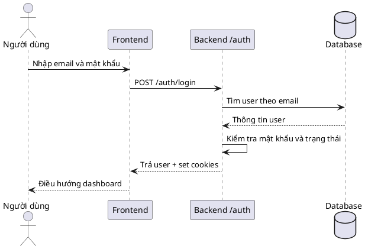

## UC02 - Đăng xuất hệ thống

### Bản đồ use case

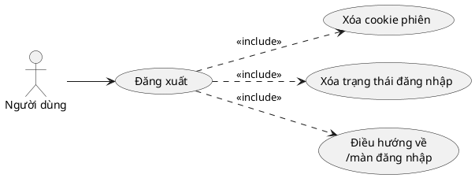

### Biểu đồ hoạt động

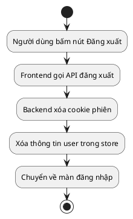

### Biểu đồ tuần tự

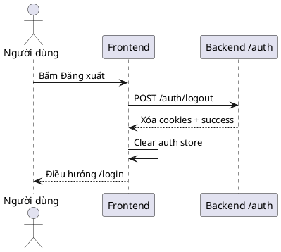

## UC03 - Xem dashboard theo farm

### Bản đồ use case

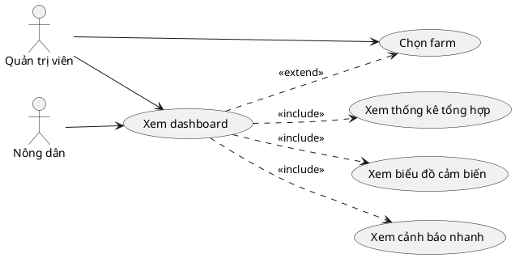

### Biểu đồ hoạt động

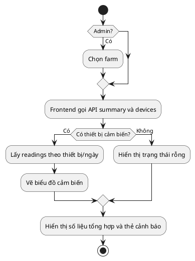

### Biểu đồ tuần tự

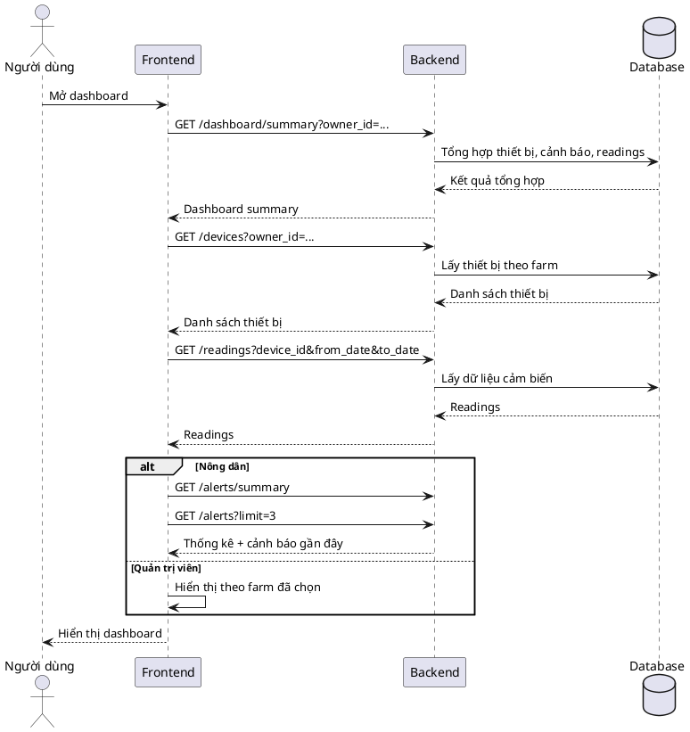

## UC04 - Quản lý thiết bị theo farm

### Bản đồ use case

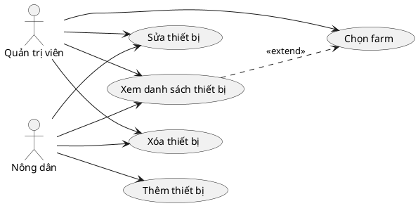

### Biểu đồ hoạt động

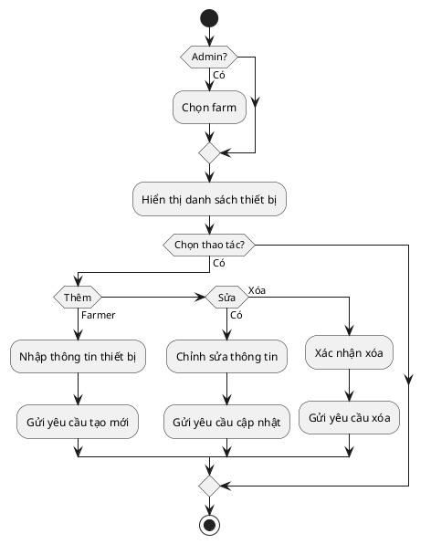

### Biểu đồ tuần tự

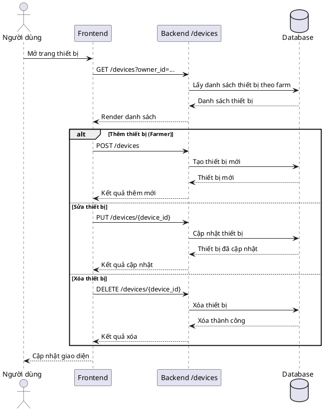

## UC05 - Quản lý cảnh báo theo farm

### Bản đồ use case

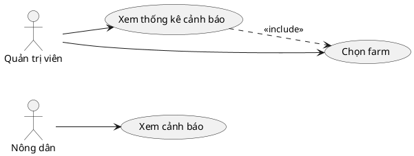

### Biểu đồ hoạt động

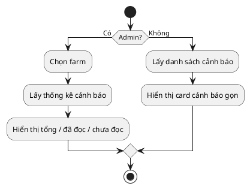

### Biểu đồ tuần tự

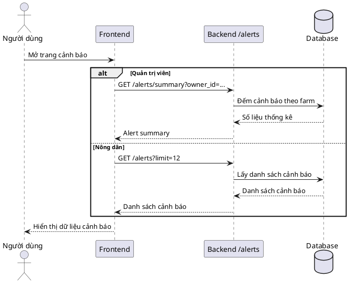

## UC06 - Đánh dấu cảnh báo đã đọc

### Bản đồ use case

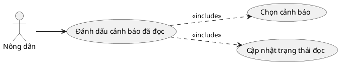

### Biểu đồ hoạt động

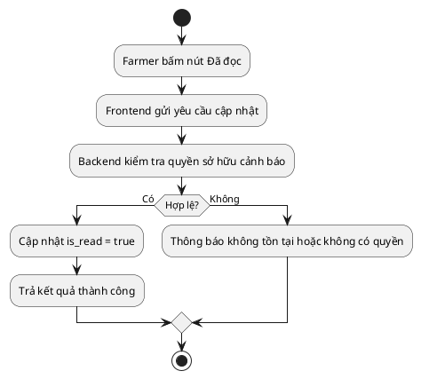

### Biểu đồ tuần tự

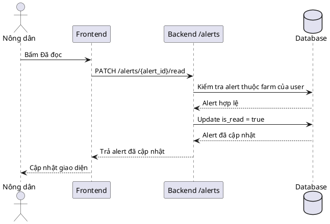

## UC07 - Xuất báo cáo CSV cảm biến

### Bản đồ use case

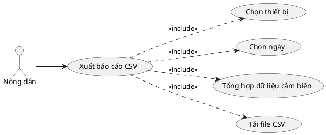

### Biểu đồ hoạt động

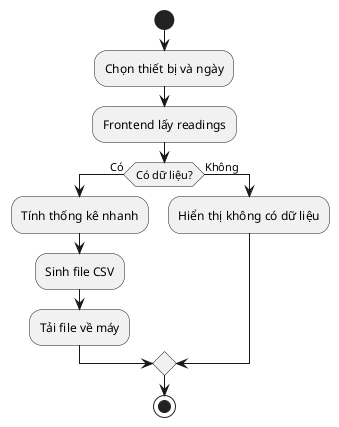

### Biểu đồ tuần tự

```plantuml
@startuml Seq_ExportCSV
actor "Nông dân" as F
participant "Frontend" as FE
participant "Backend /readings" as BE
database "Database" as DB

F -> FE : Chọn thiết bị và ngày
FE -> BE : GET /readings?device_id&from_date&to_date
BE -> DB : Lấy dữ liệu cảm biến
DB --> BE : Danh sách readings
BE --> FE : Readings
FE -> FE : Tính trung bình / min / max
FE -> FE : Tạo CSV và tải xuống
FE --> F : File CSV được tải về
@enduml
```

## UC08 - Quản lý farmer

### Bản đồ use case

```plantuml
@startuml UC_QuanLyFarmer
left to right direction

actor "Quản trị viên" as A

usecase "Quản lý farmer" as UC0
usecase "Xem danh sách farmer" as UC1
usecase "Tạo farmer mới" as UC2
usecase "Khóa/Mở khóa farmer" as UC3

A --> UC0
UC0 ..> UC1 : <<include>>
UC0 ..> UC2 : <<include>>
UC0 ..> UC3 : <<include>>
@enduml
```

### Biểu đồ hoạt động

```plantuml
@startuml Act_QuanLyFarmer
start
:Admin mở trang người dùng;
:Hệ thống tải danh sách farmer;
if (Tạo mới?) then (Có)
  :Nhập họ tên và email;
  :Gửi yêu cầu tạo farmer;
elseif (Khóa/Mở khóa?) then (Có)
  :Chọn người dùng;
  :Gửi yêu cầu đổi trạng thái;
endif
stop
@enduml
```

### Biểu đồ tuần tự

```plantuml
@startuml Seq_QuanLyFarmer
actor "Quản trị viên" as A
participant "Frontend" as FE
participant "Backend /admin" as BE
database "Database" as DB
participant "MailHog/Email" as M

A -> FE : Mở trang farmer
FE -> BE : GET /admin/users
BE -> DB : Lấy danh sách farmer
DB --> BE : Danh sách farmer
BE --> FE : Danh sách farmer

alt Tạo farmer
  FE -> BE : POST /admin/users
  BE -> DB : Tạo user role=farmer
  DB --> BE : Farmer mới
  BE -> M : Gửi mật khẩu tạm thời
  M --> BE : Email đã gửi
  BE --> FE : Farmer mới
else Khóa/Mở khóa
  FE -> BE : PATCH /admin/users/{id}/status
  BE -> DB : Cập nhật trạng thái
  DB --> BE : User đã cập nhật
  BE --> FE : User đã cập nhật
end
FE --> A : Hiển thị kết quả
@enduml
```

## Ghi chú

- Use case `Chọn farm` là thao tác nền cho admin ở dashboard, devices và alerts; nó không tách riêng thành một use case chính để tránh lặp.
- Các biểu đồ hoạt động và tuần tự ở đây được viết đơn giản hóa để dễ đọc trong báo cáo đồ án.
- `Xuất báo cáo CSV` là chức năng client-side: dữ liệu được lấy từ API đọc cảm biến, sau đó frontend tự tổng hợp và tải file.
